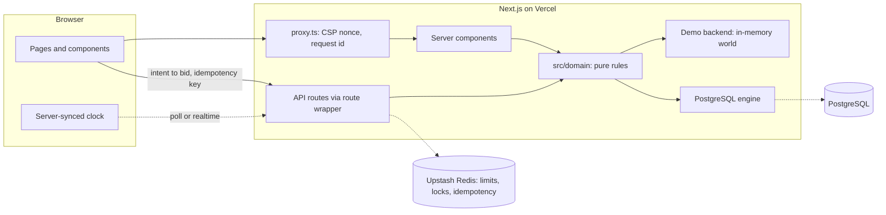

# ESOCITY BID

**The Intelligent Live Marketplace.** Live Commerce. Smarter Bidding.

Esocity Bid is a commerce platform that brings live auctions, a fixed-price marketplace, Flash
Drops, Buy Now, rewards, personalisation, responsible-use controls, operations tooling and fraud
intelligence together in one product. It is built for Esocity by AX / Ambidexters.

This repository contains the **Phase 1 MVP**: a complete, deployable product demonstration that
runs on Vercel with **no external services** (`DEMO_MODE=true`), plus the production foundations
for the next phases: PostgreSQL schema and migrations, an append-only ledger design, a row-locked
PostgreSQL auction engine, Redis-backed controls and provider adapters.

> Demo mode is clearly labelled throughout the product. Bidders, payments, deliveries and
> analytics are simulated; no real money moves and no card details are ever collected.

## What you can do in the demo

| Area                              | Highlights                                                                                                                                                                                                                                                                              |
| --------------------------------- | --------------------------------------------------------------------------------------------------------------------------------------------------------------------------------------------------------------------------------------------------------------------------------------- |
| **Live auctions**                 | Server-authoritative engine, real countdowns from server time, timer extensions, hard stops, reserves, minimum-participant rules, beginner and tier-gated formats, anonymised simulated bidders.                                                                                        |
| **Bid Wallet**                    | Append-only ledger of purchased and promotional credits, expiry, refunds, Buy Now recovery and a full transaction history. Bid packs: Starter, Popular, Power, Pro.                                                                                                                     |
| **AutoBid**                       | Server-side agents that bid in the final seconds when you are not leading, within your budget; a global operations kill switch.                                                                                                                                                         |
| **Buy Now + recovery**            | Buy the item at a fixed price, with eligible bids returned or credited per the auction's rules.                                                                                                                                                                                         |
| **Marketplace**                   | 50 products across 12 categories: search, filters, product pages, basket and a simulated checkout.                                                                                                                                                                                      |
| **Flash Drops**                   | Limited-stock, time-boxed releases with per-member limits and member-only drops.                                                                                                                                                                                                        |
| **Rewards**                       | Tiers, points on purchases (never on bid spend), achievements and redemptions.                                                                                                                                                                                                          |
| **Account**                       | Orders and tracking, watchlist, notifications, addresses, preferences, and responsible-use limits (24-hour delay on increases, cool-off breaks).                                                                                                                                        |
| **Operations console** (`/admin`) | Dashboard, analytics, auctions (create, edit rules, pause/resume/cancel), products, inventory, suppliers, orders and fulfilment, payments and refunds, promotions, customers, support, fraud intelligence and the audit log, with role-based access you can switch between in the demo. |
| **Compliance hooks**              | Per-market switches for paid bidding and bid recovery, age and jurisdiction eligibility, terms acceptance (versioned), promotion restrictions, spending controls and a KYC placeholder — configuration, not legal conclusions ([COMPLIANCE](./docs/COMPLIANCE.md)).                     |

## Quick start

Requirements: Node.js 22.12+ and pnpm 10 (`corepack enable`).

```bash
pnpm install
pnpm dev
```

Open http://localhost:3000 and choose **Enter demo** to receive a sandboxed account with a demo
Bid Wallet. The operations console is at http://localhost:3000/admin. No `.env` file is needed;
copy `.env.example` to `.env.local` only when you start connecting real services.

## Scripts

| Command                                                 | Purpose                                                                                                   |
| ------------------------------------------------------- | --------------------------------------------------------------------------------------------------------- |
| `pnpm dev`                                              | Development server (Turbopack).                                                                           |
| `pnpm build` / `pnpm start`                             | Production build and server.                                                                              |
| `pnpm lint` · `pnpm typecheck` · `pnpm format:check`    | Static checks (`pnpm format` rewrites).                                                                   |
| `pnpm test`                                             | Unit, domain, infrastructure and concurrency tests (Vitest).                                              |
| `pnpm test:db`                                          | PostgreSQL integration tests: engine, ledgers, constraints, seed. Needs `DATABASE_URL` ending in `_test`. |
| `pnpm test:e2e`                                         | Playwright journeys on desktop and mobile against a production build.                                     |
| `pnpm secret-scan`                                      | Fails on anything that looks like a credential.                                                           |
| `pnpm validate`                                         | Secret scan, format, lint, typecheck, tests and build, as CI runs them.                                   |
| `pnpm db:generate` · `pnpm db:migrate` · `pnpm db:seed` | Drizzle migrations and the idempotent seed.                                                               |

### Local PostgreSQL and Redis (optional)

```bash
docker compose up -d
export DATABASE_URL=postgres://postgres@127.0.0.1:5432/esocity
pnpm db:migrate && pnpm db:seed
DATABASE_URL=postgres://postgres@127.0.0.1:5432/esocity_test pnpm test:db
```

## Architecture at a glance



- **One rulebook, two backends.** Auction, wallet, inventory, order, promotion, reward,
  responsible-use and fraud rules are pure functions in `src/domain`, shared by the demo backend
  and the PostgreSQL engine.
- **Ledgers, not counters.** Every credit, point, stock movement and payment is an append-only
  event; balances are projections that must reconcile.
- **Defence in depth.** Zod validation, same-origin checks, RBAC, rate limiting, idempotency keys,
  audit logging, a nonce-based CSP, row locks and database constraints.

Read more in [docs/ARCHITECTURE.md](./docs/ARCHITECTURE.md).

## Deploying

**[Import this repository into Vercel](https://vercel.com/new/import?s=https%3A%2F%2Fgithub.com%2FImomazin%2Fesocity-bid-platform)**
(or open [vercel.com/new](https://vercel.com/new) and pick `Imomazin/esocity-bid-platform`).

Keep the detected settings (Next.js, root `./`, pnpm) and deploy — no environment variables are
needed, because `DEMO_MODE` defaults to `true`. Optionally set `NEXT_PUBLIC_APP_URL` to the
deployment URL. Vercel then redeploys on every push and posts a preview link on every pull request.
Check `https://<your-deployment>/api/health` reports `"mode":"demo"`.

The step-by-step guide and the integration sequence (PostgreSQL → Redis → Auth → Stripe →
realtime → email → storage → shipping) are in [docs/VERCEL_DEPLOYMENT.md](./docs/VERCEL_DEPLOYMENT.md).

## Documentation

| Document                                         | Covers                                                          |
| ------------------------------------------------ | --------------------------------------------------------------- |
| [PRODUCT](./docs/PRODUCT.md)                     | Positioning, personas, journeys, feature map.                   |
| [ARCHITECTURE](./docs/ARCHITECTURE.md)           | System design, modules, runtime composition, request lifecycle. |
| [DATA_MODEL](./docs/DATA_MODEL.md)               | PostgreSQL schema, ledgers, constraints and triggers.           |
| [AUCTION_ENGINE](./docs/AUCTION_ENGINE.md)       | State machine, bid algorithm, timers, outcomes, concurrency.    |
| [BID_WALLET](./docs/BID_WALLET.md)               | Credit ledger, buckets, expiry, packs, recovery.                |
| [PAYMENTS](./docs/PAYMENTS.md)                   | Provider abstraction, checkout, refunds, webhooks.              |
| [REALTIME](./docs/REALTIME.md)                   | Server clock, polling transport, Ably upgrade path.             |
| [INVENTORY](./docs/INVENTORY.md)                 | Stock ledger, reservations, replenishment.                      |
| [FULFILMENT](./docs/FULFILMENT.md)               | Order lifecycle, shipping, returns.                             |
| [FRAUD](./docs/FRAUD.md)                         | Risk signals, scoring, human-in-the-loop decisions.             |
| [SECURITY](./docs/SECURITY.md)                   | Threat model and controls.                                      |
| [COMPLIANCE](./docs/COMPLIANCE.md)               | Areas requiring legal review before launch.                     |
| [RESPONSIBLE_USE](./docs/RESPONSIBLE_USE.md)     | Limits, cool-offs, product safeguards.                          |
| [VERCEL_DEPLOYMENT](./docs/VERCEL_DEPLOYMENT.md) | First deployment and integration sequence.                      |
| [ROADMAP](./docs/ROADMAP.md)                     | Phases 1–9.                                                     |

Contributor and AI-agent rules: [CLAUDE.md](./CLAUDE.md).

## Licence

Proprietary. © Esocity. All rights reserved. Product artwork is generated for this project; no
third-party product imagery, trademarks or competitor designs are used.
