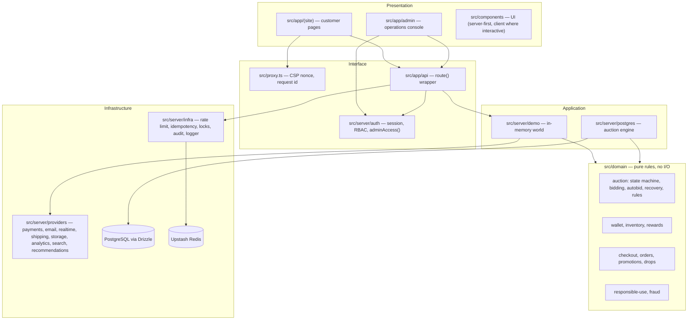
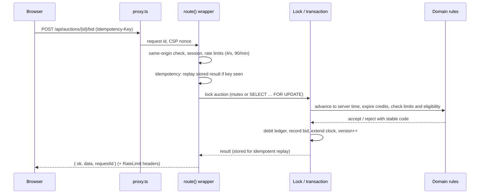

# Architecture

Esocity Bid is a single Next.js 16 (App Router) application deployed on Vercel. Business rules
live in a pure domain layer; storage and integrations sit behind ports with a demo adapter and a
production adapter each. The same rules therefore run in the zero-dependency demo and in the
PostgreSQL + Redis production engine.

## Layers

| Module                  | Responsibility                                                                                                                                                                                                                                         |
| ----------------------- | ------------------------------------------------------------------------------------------------------------------------------------------------------------------------------------------------------------------------------------------------------ |
| `src/domain`            | Deterministic functions: `evaluateBid`, `applyAcceptedBid`, `determineOutcome`, `transition`, `planDebit`, `collectExpiries`, `projectInventory`, `priceCheckout`, `evaluatePromotion`, `checkBidAllowance`, `assessRisk`… Time is always an argument. |
| `src/lib`               | Money (integer minor units, BigInt rounding), deterministic formatting, config (env validation, markets, feature flags), ids, time.                                                                                                                    |
| `src/server/http`       | `route()` wraps every API route: envelope, request id, CSRF, auth, RBAC, rate limits, Zod validation, idempotency, error mapping.                                                                                                                      |
| `src/server/runtime.ts` | Composition root: picks an implementation for every port from configuration.                                                                                                                                                                           |
| `src/server/demo`       | The demo backend: catalogue, series scheduler, simulated bidders, AutoBid, orders, drops, rewards, support, admin operations — all on the domain layer.                                                                                                |
| `src/server/postgres`   | Production auction engine: transactions, row locks, DB clock, ledger writes, idempotent replay.                                                                                                                                                        |
| `db`                    | Drizzle schema (51 tables), migrations (including append-only triggers) and an idempotent seed.                                                                                                                                                        |

## Runtime composition

`getRuntime()` builds one runtime per server instance (kept on `globalThis` so it survives
development hot reloads):

| Port         | Demo (default)                          | Production                                                                                                                                                                                         |
| ------------ | --------------------------------------- | -------------------------------------------------------------------------------------------------------------------------------------------------------------------------------------------------- |
| Backend      | `DemoBackend` (in memory)               | PostgreSQL engine (`src/server/postgres`); full wiring is Phase 2                                                                                                                                  |
| Rate limiter | In-memory sliding log                   | Redis sliding window (Lua, atomic) when Upstash is configured                                                                                                                                      |
| Locks        | In-process FIFO mutex per key           | Redis `SET NX PX` with token-checked release                                                                                                                                                       |
| Idempotency  | In-memory store                         | Redis store (24 h TTL). The PostgreSQL engine is idempotent on its own (unique keys on bids and ledger entries); the `idempotency_keys` table is ready for a database-backed HTTP store in Phase 2 |
| Payments     | `DemoPaymentProvider` (no card data)    | Stripe hosted Checkout + signed webhooks                                                                                                                                                           |
| Realtime     | Polling against authoritative snapshots | Ably channels (`auction:{id}`)                                                                                                                                                                     |
| Email        | Logged, never sent                      | Resend                                                                                                                                                                                             |
| Storage      | Generated artwork                       | Vercel Blob / S3                                                                                                                                                                                   |
| Analytics    | Structured logger                       | PostHog / GA4 adapter                                                                                                                                                                              |

Configuration never breaks the build: every variable is optional, validated lazily on first use,
and invalid values fall back to demo defaults while `/api/health` reports the issue.

## Request lifecycle (placing a bid)

## The demo world

The demo backend is deterministic from wall-clock time, so every server instance derives the
same auctions:

- **Series scheduler.** 22 auction series run recurring instances on fixed cycles. Each series
  announces its next auction 45 minutes before its cycle starts, so 20+ auctions are always
  live or upcoming. The last few cycles remain visible as completed history.
- **Simulated bidders.** Anonymised handles (e.g. `M***a`, `Zed_9`) follow a per-auction
  intensity profile: an opening phase with exponential gaps and a closing phase that may end at
  any extension window. Simulated bids go through the same `evaluateBid` rules and are always
  labelled as simulated.
- **Lazy advancement.** Every request calls `sync()`, which replays simulated bids, AutoBid
  agents and finalisations up to the current server time — no background workers are needed on
  Vercel.
- **Sandboxed members.** "Enter demo" creates a private account (httpOnly session cookie) with
  realistic history: wallet ledger, orders, rewards, watchlist and notifications.

## Rendering and performance

- Server components by default; client components only for interactivity (bid panel, forms,
  charts, search).
- One shared server-synced clock (`useSyncExternalStore`) drives every countdown; pages never
  re-render wholesale every second.
- Auction pages poll a small authoritative snapshot (1 s while live, 5 s otherwise); lists use a
  batched snapshot endpoint.
- Deterministic formatting (`src/lib/format.ts`) keeps server and browser output identical.

## Production evolution

Phase 2 swaps the demo backend for PostgreSQL + Redis behind the same routes: the PostgreSQL
auction engine already exists and is tested (`tests/db`). Scheduled start and finalisation run
from a cron route or queue worker calling `startDueAuctions()` / `finalizeDueAuctions()`.
See [ROADMAP.md](./ROADMAP.md).
