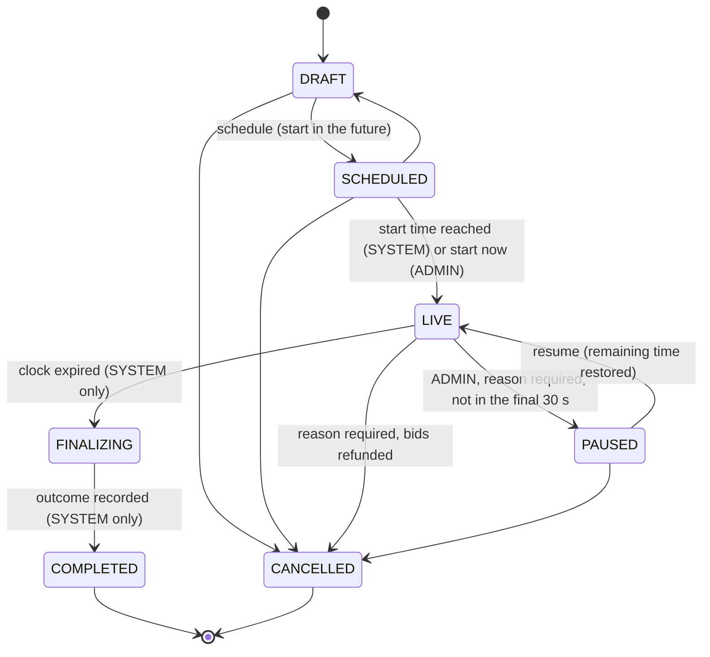
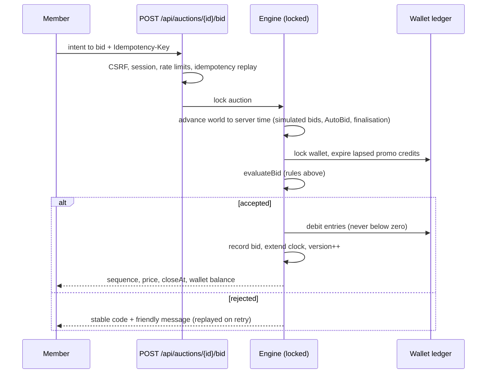

# Auction engine

The auction engine is **server-authoritative**. The browser submits an intent to bid; the server
decides — under a lock, at the server's time — whether the bid is accepted, what the new price and
close time are, and, at the close, who won. The rules are pure functions in
`src/domain/auction/` and are shared by both engines:

| Engine     | Where                                   | Serialisation                                                 | Clock                                                    |
| ---------- | --------------------------------------- | ------------------------------------------------------------- | -------------------------------------------------------- |
| Demo       | `src/server/demo`                       | Per-auction in-process mutex (`MemoryLockProvider`)           | Server `Date.now()`                                      |
| Production | `src/server/postgres/auction-engine.ts` | `SELECT … FOR UPDATE` on the auction row, then the wallet row | PostgreSQL `clock_timestamp()` read after locks are held |

## Lifecycle

`FINALIZING` and `COMPLETED` are reachable **only by the SYSTEM actor**: no member of staff can
choose, change or override a winner. Every transition is validated (`assertTransition`), bumps the
state `version`, and is recorded in `auction_transitions` and the audit log.

Timer side effects (`transition`):

- **SCHEDULED → LIVE** starts the clock: `closeAt = startsAt + timerSeconds`; a hard stop is set
  to `startsAt + hardStopAfterSeconds`. An admin "start now" moves the start to now.
- **LIVE → PAUSED** freezes the remaining time.
- **PAUSED → LIVE** restores it (never less than one extension window) and moves any hard stop
  back by the paused duration, so a pause never shortens or lengthens the contest.

## Placing a bid

`evaluateBid(state, attempt, bidder)` returns an acceptance or a rejection with a stable code.
Checks run in this order:

| #   | Check                                                                          | Rejection code                                        |
| --- | ------------------------------------------------------------------------------ | ----------------------------------------------------- |
| 1   | Status is `LIVE` (paused, ended, cancelled and not-yet-open are distinguished) | `AUCTION_PAUSED`, `AUCTION_ENDED`, `AUCTION_NOT_LIVE` |
| 2   | Server time ≥ start and **< close** (a bid at the close instant is too late)   | `AUCTION_NOT_LIVE`, `AUCTION_ENDED`                   |
| 3   | Account not restricted (e.g. a risk hold pending human review)                 | `ACCOUNT_RESTRICTED`                                  |
| 4   | Not already the leader, when self-outbidding is prevented                      | `ALREADY_LEADING`                                     |
| 5   | Per-member bid limit                                                           | `BID_LIMIT_REACHED`                                   |
| 6   | Participant cap (existing participants may continue)                           | `PARTICIPANT_CAP_REACHED`                             |
| 7   | Eligibility: region, age, reward tier, previous wins, account age              | `NOT_ELIGIBLE`                                        |
| 8   | Responsible-use limits: cool-off, daily and weekly bid limits                  | `RESPONSIBLE_USE_LIMIT`                               |
| 9   | Enough spendable credits (after expiring lapsed promotional credits)           | `INSUFFICIENT_CREDITS`                                |

An accepted bid:

- takes the next **gap-free sequence number** (`bidCount + 1`);
- raises the price by exactly one increment (`price = start + bidCount × increment`, also a
  database `CHECK`);
- extends the clock so at least `timerExtensionSeconds` remain, **capped by the hard stop**:
  `closeAt' = min(max(closeAt, now + extension), hardCloseAt)`;
- debits the credit cost from the wallet (earliest-expiring promotional credits first);
- records the bid, updates the participant summary, bumps `version`.

## Concurrency guarantees

- **Serialised per auction.** Every bid on an auction runs inside the auction's lock (mutex or row
  lock). Thirty simultaneous bidders produce thirty consecutive sequence numbers and exactly
  thirty debits (`tests/db/auction-engine.test.ts`, `tests/unit/demo-backend.test.ts`).
- **Optimistic version check.** The PostgreSQL update includes `WHERE version = expected`; a stale
  write fails instead of overwriting.
- **Double clicks and retries.** Each click intent carries an `Idempotency-Key`. A repeat returns
  the stored response (`Idempotent-Replayed: true`) and never debits twice; the PostgreSQL engine
  also enforces unique idempotency keys on bids and ledger entries.
- **Self-outbid protection.** A second concurrent click by the leader is rejected with
  `ALREADY_LEADING`.
- **Database backstops.** Bids can only be inserted while the auction row is `LIVE`
  (trigger); ledgers and bids are append-only; balances cannot go negative (`CHECK`).

## Closing and outcomes

When the clock expires the SYSTEM moves the auction to `FINALIZING`, computes the outcome with
`determineOutcome` and completes it — **exactly once** (the row lock plus the state machine make a
second finalisation a no-op).

| Outcome                    | When                                                            | Effect                                                                                                                                                           |
| -------------------------- | --------------------------------------------------------------- | ---------------------------------------------------------------------------------------------------------------------------------------------------------------- |
| `WON`                      | At least one bid, enough distinct bidders, reserve (if any) met | Winner = the leader at the authoritative close time. A `PENDING_PAYMENT` order is created at the final price with a payment window (`winnerPaymentWindowHours`). |
| `NO_BIDS`                  | Nobody bid                                                      | No sale.                                                                                                                                                         |
| `MIN_PARTICIPANTS_NOT_MET` | Fewer distinct bidders than `minimumParticipants`               | No sale; **all bids refunded** (`BID_REFUND` entries).                                                                                                           |
| `RESERVE_NOT_MET`          | Final price below the reserve                                   | No sale; **all bids refunded**.                                                                                                                                  |
| (cancelled)                | An admin cancels with a reason                                  | **All bids refunded**; reserved stock released.                                                                                                                  |

The result row (`auction_results`) is immutable. If a winner does not pay within the window the
order is cancelled and stock released (Phase 2 adds second-chance offers).

## Configurable rules

All formats are configuration (`AuctionRules`, validated by `auctionRulesSchema`): starting price,
increment, credit cost, initial timer, extension, minimum/maximum participants, hard stop, Buy Now
(price override), recovery (on/off, mode `RETURN_BIDS` or `PRICE_CREDIT`, window, promotional
bids included), reserve, winner payment window, per-member bid limit, AutoBid on/off,
self-outbid prevention and eligibility (tier, previous wins, account age, markets, minimum age).

Cross-field validation rejects impossible combinations (maximum < minimum participants, a hard
stop before the initial timer ends, recovery without Buy Now).

**Once bidding starts, the economics are locked.** In `LIVE`/`PAUSED` every sensitive field is
read-only (`lockedRuleViolations`); the only permitted change is switching AutoBid **off** (the
kill switch). After the close nothing can change.

## AutoBid

AutoBid agents run **on the server**, never in the browser (`src/domain/auction/autobid.ts`):

- A member sets a maximum number of bids (1–500, within the auction's per-member limit) and an
  optional maximum price.
- The agent bids only when the member is **not** leading, in the final `AUTOBID_TRIGGER_MS`
  (3 s) of the clock, and no sooner than `AUTOBID_REACTION_MS` (700 ms) after the previous bid,
  plus deterministic jitter — the same pacing as a human.
- Every AutoBid bid goes through the same `evaluateBid` rules, limits and wallet debits.
- It stops when the allocation or price ceiling is reached, credits run out, a responsible-use
  limit is hit, or the auction ends.
- **Kill switches:** a global operations switch (operations dashboard `/admin`, audited) and a per-auction
  rule stop every agent immediately; members are notified.

## Buy Now and bid recovery

Buy Now is available before and after the close where the rules enable it. Bid recovery for
members who bid but did not win (`quoteRecovery`, `src/domain/auction/recovery.ts`):

- `RETURN_BIDS` — eligible credits are returned to the wallet as a `BUY_NOW_RECOVERY` entry.
- `PRICE_CREDIT` — the value of **purchased** bids is deducted from the Buy Now price (never below
  zero); promotional bids are never converted into money value.

Recovery is refused for the winner, after the window closes, when bids were already refunded,
when it was already used, or when the market or feature flag disables it — each with a clear
reason. Its availability is a per-market switch because its treatment can differ by jurisdiction
(see [COMPLIANCE.md](./COMPLIANCE.md)).

## Demo simulation

Demo auctions are populated by anonymised **simulated bidders**. Their bids pass through the same
engine and rules, are flagged `SIMULATED` and are labelled "simulated" in the interface. Series
parameters (heat, opening pace, closing phase) make each auction feel different while staying
deterministic per auction, so every server instance shows the same history.

## Operating in production

- **Start and finalise on time.** A scheduled job (Vercel Cron or a queue worker) calls
  `startDueAuctions()` and `finalizeDueAuctions()` every few seconds; both are idempotent and safe to
  run from several workers at once.
- **Fan-out.** After each commit the engine publishes to `auction:{id}` (see
  [REALTIME.md](./REALTIME.md)); clients also poll the snapshot endpoint as a fallback.
- **Monitoring.** Watch finalisation lag, lock wait time, bid rejection mix and rate-limit hits.

## Tests

- `tests/unit/auction-state-machine.test.ts` — every transition, guard and timer side effect.
- `tests/unit/auction-bidding.test.ts` — rejection order, clock boundary, extensions, hard stop,
  outcomes, rule validation and locking, eligibility.
- `tests/unit/recovery-autobid.test.ts` — recovery modes and refusals; AutoBid pacing and stops.
- `tests/unit/demo-backend.test.ts` — simultaneous bids, double clicks, cool-off, kill switch, a
  full simulated day.
- `tests/db/auction-engine.test.ts` — 30 concurrent bidders, idempotent replay, no negative
  balances, the clock boundary, staff restrictions, exactly-once finalisation, refunds and the
  append-only guards on real PostgreSQL.
