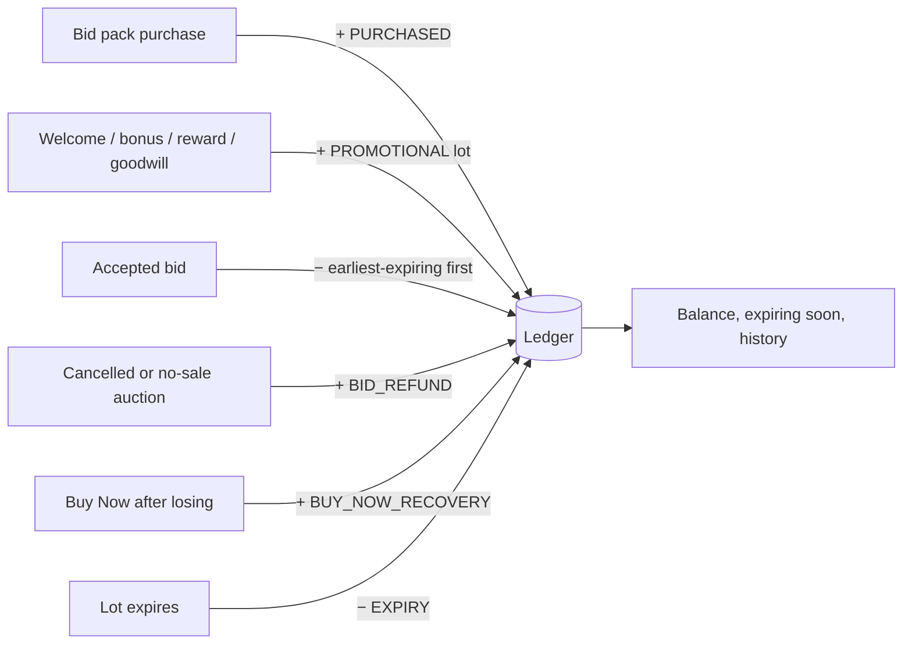

# Bid Wallet

Bid credits are **not money**. They are held in a Bid Wallet that is separate from any monetary
balance, cannot be withdrawn and are only spent on auction bids. The wallet is an **append-only
ledger**: every balance can be reconstructed by replaying its entries, and the cached balance
(`bid_wallets`) must always reconcile with the ledger (`bid_ledger_entries`).

Code: `src/domain/wallet.ts` (rules), `src/server/postgres/auction-engine.ts` (production writes),
`src/server/demo/*` (demo writes). Tests: `tests/unit/wallet.test.ts`, `tests/db/*`.

## Buckets

| Bucket        | Source                                                                 | Expiry                                                                                 |
| ------------- | ---------------------------------------------------------------------- | -------------------------------------------------------------------------------------- |
| `PURCHASED`   | Bid packs                                                              | Never                                                                                  |
| `PROMOTIONAL` | Welcome bonus, pack bonuses, rewards redemptions, goodwill, promotions | Each grant is a **lot** with its own expiry (30 days by default; pack bonuses 90 days) |

Spending consumes the **earliest-expiring promotional lots first**, then purchased credits, so
members never lose credits they could have used.

## Entry types

| Type                 | Sign | Bucket      | Meaning                                                                             |
| -------------------- | ---- | ----------- | ----------------------------------------------------------------------------------- |
| `BID_PACK_PURCHASE`  | +    | PURCHASED   | A paid bid pack.                                                                    |
| `PROMOTIONAL_CREDIT` | +    | PROMOTIONAL | A free grant (lot with an expiry).                                                  |
| `AUCTION_BID`        | −    | either      | A bid; references the bid and the lot consumed.                                     |
| `BID_REFUND`         | +    | original    | Refund for a cancelled auction or a no-sale outcome.                                |
| `BUY_NOW_RECOVERY`   | +    | original    | Credits returned after Buy Now on a lost auction.                                   |
| `ADMIN_ADJUSTMENT`   | ±    | either      | Staff correction or goodwill; permission `wallet.adjust`, reason required, audited. |
| `EXPIRY`             | −    | PROMOTIONAL | Retires the unspent remainder of a lapsed lot (one per lot, idempotent).            |

Sign and bucket rules are validated in code (`assertValidEntry`) and by database `CHECK`
constraints. Corrections are always new entries; ledger rows can never be updated or deleted.

## Guarantees

- **Never negative.** `planDebit` refuses a debit larger than the spendable balance
  (`INSUFFICIENT_CREDITS`); `bid_wallets_non_negative` and `bid_ledger_balances_non_negative`
  enforce it in the database.
- **Expired credits are never spendable**, even before the `EXPIRY` entry is written: the summary
  excludes lapsed lots at read time.
- **Exactly-once.** Entries carry idempotency keys (unique per member), so retries cannot
  double-credit or double-debit.
- **Serialised.** Debits run while holding the wallet row lock, inside the same transaction as the
  bid.
- **Reconcilable.** `reconcile()` replays the ledger, compares it with the projection and flags any
  point where a running balance dipped below zero.

## Bid packs

| Pack    | Credits | Bonus (promotional, 90 days) | Price   | Per bid |
| ------- | ------- | ---------------------------- | ------- | ------- |
| Starter | 50      | —                            | £12.50  | 25.0p   |
| Popular | 150     | 10                           | £33.00  | 20.6p   |
| Power   | 400     | 50                           | £80.00  | 17.8p   |
| Pro     | 1,000   | 150                          | £180.00 | 15.7p   |

Prices are demonstration values. The best-value pack is computed (`bestValuePackId`), not
hard-coded. Pack purchases are:

- limited by the member's **monthly bid budget** and blocked during a **cool-off**
  (see [RESPONSIBLE_USE.md](./RESPONSIBLE_USE.md));
- idempotent (`Idempotency-Key`, `bid_package_orders_idempotency_key`);
- paid through the payment provider (simulated in demo; hosted checkout in production), with
  credits granted only after the payment succeeds;
- never rewarded with loyalty points.

## What members see

`/wallet` shows the available balance split by bucket, credits expiring within seven days, a
low-balance notice below 20 credits, lifetime totals (bought, promotional, used, refunded,
recovered, expired) and the full history with references to auctions and orders. `/buy-bids`
shows packs, the price per bid and the remaining monthly budget before purchase.

## Operations

`/admin/customers` shows each member's bid-pack spend, bids used and wins alongside their risk
class. Goodwill credits (1–500, promotional, 30 days) require the `wallet.adjust` permission and a
reason, and are written to the audit log.
Cancelling an auction refunds every bid automatically; no manual balance edits exist.
