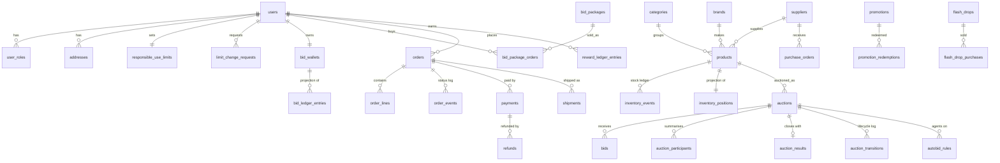

# Data model

The production data model is PostgreSQL 15+ managed with Drizzle ORM:

- `db/schema/*.ts` — 51 tables and their enums, split by bounded context.
- `db/migrations/0000_init.sql` — generated schema (tables, enums, foreign keys, indexes and
  `CHECK` constraints).
- `db/migrations/0001_append_only_guards.sql` — hand-written triggers that make ledgers
  immutable.
- `db/seed/index.ts` — idempotent seed (safe to run repeatedly): catalogue, suppliers, opening
  stock, bid packages, promotions, feature flags, fictional staff and demo member, scheduled
  auctions and drops.

Conventions: UUID primary keys; `timestamptz` everywhere; **money in integer minor units** with an
explicit currency; percentages in basis points; enums mirror the domain constants (a unit test
fails if they drift); append-only tables for anything financial, stock-related or audited.

## Contexts



| File            | Tables                                                                                                                            |
| --------------- | --------------------------------------------------------------------------------------------------------------------------------- |
| `identity.ts`   | `users`, `user_roles`, `addresses`, `user_preferences`, `responsible_use_limits`, `limit_change_requests`, `reward_accounts`      |
| `catalog.ts`    | `categories`, `brands`, `suppliers`, `supplier_contacts`, `products`, `product_images`, `purchase_orders`, `purchase_order_lines` |
| `inventory.ts`  | `inventory_events` (ledger), `inventory_positions` (projection)                                                                   |
| `auctions.ts`   | `auctions`, `auction_participants`, `bids`, `auction_results`, `autobid_rules`, `auction_transitions`                             |
| `wallet.ts`     | `bid_wallets` (projection), `bid_ledger_entries` (ledger), `bid_packages`, `bid_package_orders`                                   |
| `commerce.ts`   | `carts`, `cart_items`, `orders`, `order_lines`, `order_events`, `payments`, `payment_events`, `refunds`, `shipments`              |
| `promotions.ts` | `promotions`, `promotion_redemptions`, `flash_drops`, `flash_drop_purchases`                                                      |
| `engagement.ts` | `watchlist_items`, `notifications`, `reward_ledger_entries`, `achievement_unlocks`, `support_tickets`, `support_messages`         |
| `platform.ts`   | `audit_events`, `idempotency_keys`, `feature_flags`, `fraud_cases`, `analytics_events`                                            |

## Ledgers and projections

| Ledger (append-only)             | Projection                         | Invariant                                                                                   |
| -------------------------------- | ---------------------------------- | ------------------------------------------------------------------------------------------- |
| `bid_ledger_entries`             | `bid_wallets`                      | Per-bucket sums equal the wallet row; balances never negative.                              |
| `inventory_events`               | `inventory_positions`              | `reserved ≤ on_hand`, every figure `≥ 0`, so overselling is impossible.                     |
| `reward_ledger_entries`          | `reward_accounts`                  | Balance never negative; points only from purchases, achievements, referrals or adjustments. |
| `order_events`, `payment_events` | `orders.status`, `payments.status` | Every status change has an event with actor and time.                                       |
| `auction_transitions`            | `auctions.status`                  | Every lifecycle change is logged with actor and reason.                                     |
| `audit_events`                   | —                                  | Immutable record of staff and system actions.                                               |

Projections are updated **in the same transaction** as the ledger entry, with the projection row
locked (`SELECT … FOR UPDATE`).

## Integrity at the database level

The application enforces every rule in code; the database enforces them again so a bug or a
manual query cannot corrupt state.

**Append-only triggers** (`0001_append_only_guards.sql`) reject `UPDATE`, `DELETE` and
`TRUNCATE` on `audit_events`, `bids`, `bid_ledger_entries`, `inventory_events`, `order_events`,
`payment_events`, `reward_ledger_entries` and `auction_transitions`, whatever the calling role.
`auction_results` can never change its outcome, winner, price or close time. A `bids` insert is
rejected unless the auction row is `LIVE`.

**CHECK constraints** (selection):

| Constraint                                                                                      | Guarantees                                                                                   |
| ----------------------------------------------------------------------------------------------- | -------------------------------------------------------------------------------------------- |
| `bid_wallets_non_negative`, `bid_ledger_balances_non_negative`                                  | A bid balance can never go below zero.                                                       |
| `bid_ledger_sign_by_type`, `bid_ledger_purchase_bucket`, `bid_ledger_promotional_expiry`        | Credits are positive, debits negative; bucket and expiry rules per entry type.               |
| `auctions_price_matches_bids`                                                                   | `price = starting price + bid_count × increment` — the price can only move by accepted bids. |
| `auctions_pause_state`, `auctions_close_after_start`, `auctions_hard_close_bound`               | Timer state is internally consistent.                                                        |
| `auctions_recovery_requires_buy_now`, `auctions_hard_stop_after_timer`, `auctions_participants` | Rule combinations are valid.                                                                 |
| `auction_results_winner_consistency`                                                            | Only a `WON` outcome has a winner.                                                           |
| `inventory_positions_reserved_within_on_hand`                                                   | No overselling.                                                                              |
| `orders_total_consistent`, `orders_amounts_non_negative`, `order_lines_total`                   | Totals add up.                                                                               |
| `refunds_amount_positive`, `payments_amounts`                                                   | Refunds and payments are well formed.                                                        |
| `limit_change_requests_delay`                                                                   | A raised limit takes effect at least 24 hours after the request.                             |
| `fraud_cases_no_automated_block`, `fraud_cases_decision_note`                                   | Automation never blocks; decisions carry a note.                                             |

**Unique indexes** make retries safe and prevent duplicates: `bids_auction_sequence_key`
(gap-free sequence per auction), `bids_idempotency_key`, `bid_ledger_idempotency_key`,
`orders_idempotency_key`, `orders_one_win_per_auction`, `refunds_idempotency_key`,
`payment_events_provider_event_key` (webhook deduplication), `autobid_rules_one_active` (one active
agent per member per auction), `addresses_one_default_per_user`, `notifications_dedupe_key`.

## Money

All amounts are `integer` minor units (pence) with a `currency` column. Tax is stored on the
order (`tax_minor`, `tax_inclusive`); discounts, shipping and recovery credits are separate
columns so totals can be re-derived and checked by `orders_total_consistent`.

## Time

The PostgreSQL engine reads `clock_timestamp()` inside the transaction after taking locks, so the
database clock (not an application server, never a browser) decides whether a bid arrived before
the close.

## Migrations and seeding

```bash
pnpm db:generate   # after editing db/schema — generates SQL, no database needed
pnpm db:migrate    # applies db/migrations to DATABASE_URL
pnpm db:seed       # idempotent: safe to run on every deploy
```

Custom SQL (triggers, functions) goes in a `drizzle-kit generate --custom` migration, never in a
hand-edited generated file. The database integration tests (`pnpm test:db`) reset a database whose
name must end in `_test`, apply all migrations and exercise the engine, constraints and seed.
