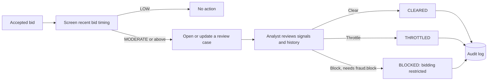

# Fraud and bot intelligence

The platform computes **risk indicators, not accusations**. Signals are combined into a 0–100
score, a risk class and a _recommended_ action for a human analyst. Automation is limited to
throttling; blocking an account always requires a recorded human decision. Nothing a customer sees
states or implies wrongdoing.

Code: `src/domain/fraud.ts` (signals, scoring), `src/server/demo/bidding.ts` (screening after
bids), `src/server/demo/admin.ts` (decisions). UI: `/admin/fraud`. Tests:
`tests/unit/rewards-fraud.test.ts`.

## Signals

| Code                   | Detected when                                                                               | Weight                                         |
| ---------------------- | ------------------------------------------------------------------------------------------- | ---------------------------------------------- |
| `BID_VELOCITY`         | More than 30 bids in the last 60 seconds                                                    | 20 + 2 per extra bid, max 60                   |
| `IMPOSSIBLE_FREQUENCY` | 3+ of the last 20 intervals between bids are under 150 ms                                   | 35 + 5 per interval, max 70                    |
| `AUTOMATION_PATTERN`   | 12+ recent intervals with variation under 8% and a mean under 30 s (machine-regular timing) | 45                                             |
| `SHARED_DEVICE`        | Device shared with other accounts                                                           | Placeholder for a device-intelligence provider |
| `ACCOUNT_ANOMALY`      | Unusual account activity                                                                    | Placeholder                                    |
| `PAYMENT_RISK`         | Payment provider risk indicator                                                             | Placeholder (e.g. Stripe Radar)                |
| `PROMO_ABUSE`          | Repeated promotion use across related accounts                                              | Placeholder                                    |
| `REFUND_ABUSE`         | Refund rate above the normal range                                                          | Placeholder                                    |

The bid-timing signals are implemented and tested; the placeholders have the same interface so
provider data can be attached in Phase 2 without changing scoring or workflows.

## Scoring

Signals combine like independent probabilities, which keeps the score bounded and monotonic
(adding a signal can never lower it):

```
score = round(100 × (1 − Π (1 − weightᵢ / 100)))
```

| Score  | Class      | Recommended     | Applied automatically                        |
| ------ | ---------- | --------------- | -------------------------------------------- |
| 0–24   | `LOW`      | Allow           | Allow                                        |
| 25–49  | `MODERATE` | Review          | Review (case opened)                         |
| 50–74  | `HIGH`     | Throttle        | Throttle                                     |
| 75–100 | `CRITICAL` | Block (analyst) | **Throttle only** — never an automatic block |

The database enforces the last rule too: `fraud_cases_no_automated_block`.

## Workflow



- Screening runs after each member bid. One open case per member is kept up to date rather than
  opening duplicates; creating a case is itself audited ("risk indicators on bidding activity").
- Case statuses: `OPEN`, `UNDER_REVIEW`, `CLEARED`, `THROTTLED`, `BLOCKED`.
- Decisions need a note (at least a short sentence) and are written to the audit log with the
  analyst, time and severity. `fraud.decide` (Operations, Admin) covers clear, review and
  throttle; **blocking requires `fraud.block`**, held only by Super Admin.
- A throttle decision is recorded now; in production it moves the member to a stricter
  rate-limit policy. Clearing a case lifts any restriction.
- A block restricts bidding. The member sees only "Bidding is temporarily unavailable on this
  account. Please contact support." — no reasons, scores or accusations.

## Always-on protections

These apply to everyone, independent of scoring:

- Rate limits on bids (4 per second burst, 90 per minute sustained), AutoBid set-up, checkout,
  bid-pack purchases, promotion validation and demo sessions.
- Idempotency keys on every money or credit movement.
- Server-side AutoBid — no browser automation is needed or rewarded.
- Staff accounts cannot bid in auctions (the PostgreSQL engine rejects them with a clear message).

## Fairness and privacy

- Signals are about behaviour on the platform, not protected characteristics.
- Analysts see the evidence behind every score; nothing is decided by an opaque model.
- In demo mode, fraud cases for simulated members are labelled simulated and use fictional data.
- Data retention for risk evidence needs a policy before launch (see
  [COMPLIANCE.md](./COMPLIANCE.md)).
