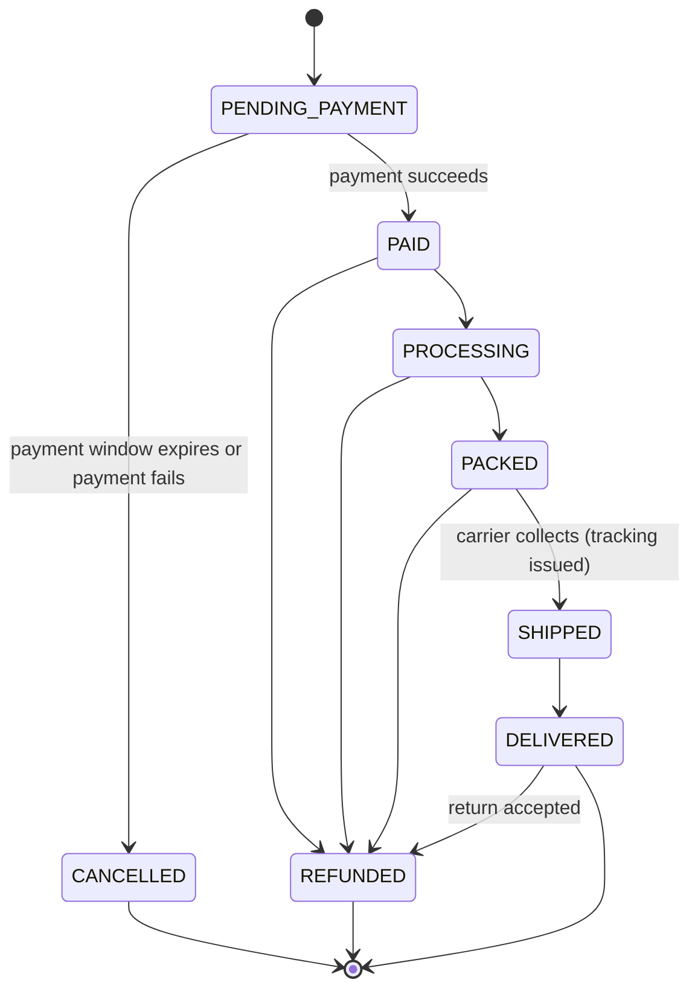

# Fulfilment

Every purchase — marketplace basket, auction win, Buy Now or Flash Drop — becomes an **order** with
one lifecycle, an append-only event history and a clear status for the member.

Code: `src/domain/orders.ts` (state machine), `src/server/demo/orders.ts` and
`src/server/demo/world.ts` (demo flows), `src/server/providers/shipping.ts` (carrier port).

## Order lifecycle

- Transitions are validated by `transitionOrder`; an invalid move is rejected with
  `INVALID_TRANSITION`. A shipped parcel cannot be refunded until it is delivered or returned.
- Each transition appends an event (status, time, actor, optional note) — the member's timeline
  and the operations history come from the same record (`order_events` in PostgreSQL,
  append-only).
- Order sources: `MARKETPLACE`, `AUCTION_WIN`, `AUCTION_BUY_NOW`, `FLASH_DROP`.

## Auction wins

When an auction closes with a winner, the engine creates a `PENDING_PAYMENT` order at the final
price with a payment deadline (`winnerPaymentWindowHours`, 72 hours by default). The member pays
from `/orders/[id]` or the auction page. If the deadline passes, the order is cancelled, the
reserved unit is released and the member is notified. At most one win order exists per auction
(`orders_one_win_per_auction`).

## Delivery options (UK)

| Method   | Price                                | Timing                               |
| -------- | ------------------------------------ | ------------------------------------ |
| Standard | £3.99, free from £50 after discounts | 3–5 working days                     |
| Express  | £6.99                                | 1–2 working days                     |
| Next day | £9.99                                | Next working day when ordered by 8pm |

Large items add a £15 handling surcharge; digital items (gift cards, vouchers) need no address.
Silver members get free standard delivery from £30. The market configuration
(`src/lib/config/market.ts`) holds these values, so other markets can differ without code
changes.

## Demo fulfilment

In demo mode paid orders advance automatically so the whole journey can be seen in minutes:
`PAID → PROCESSING` (2 min) `→ PACKED` (4 min) `→ SHIPPED` (6 min, with a demo tracking number and
carrier) `→ DELIVERED` (20 min). Every step notifies the member and is labelled as demo
fulfilment.

## Operations

- `/admin/fulfilment` — a board of paid, processing, packed, shipped and recently delivered orders,
  oldest first, so the team can see what is waiting longest.
- `/admin/orders` and `/admin/orders/[id]` — search and filter orders, advance status (with notes),
  view payments and refunds, and issue refunds (`refunds.issue`).
- Status changes and refunds are recorded in the audit log with the staff member and reason.

## Returns

Members have a 30-day returns window in the UK market (45 days for Gold members), plus the
statutory 14-day cancellation period for distance sales. A returned item posts `RETURNED`
inventory events, then `RESTOCKED` (or `DAMAGED`) after inspection, and the refund follows the
rules in [PAYMENTS.md](./PAYMENTS.md). Carrier label and returns-portal integrations are Phase 5.

## Shipping provider port

`ShippingProvider.createShipment` returns a carrier, a tracking number and, when available, a label. The
demo adapter generates them; multi-carrier adapters (the port already names Shippo and EasyPost)
plug in behind the same interface in Phase 5, adding live rate quotes, labels and tracking
webhooks ([ROADMAP.md](./ROADMAP.md)).
