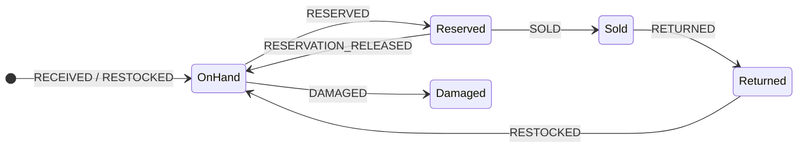

# Inventory

Stock is an **append-only event ledger** per product. Positions (on hand, reserved, available,
sold, damaged, returned) are projections of that ledger and are never edited directly. Auctions,
checkouts and Flash Drops **reserve** stock before selling it, so the platform can never promise
more units than it holds.

Code: `src/domain/inventory.ts` (rules), `db/schema/inventory.ts` (tables), demo writes in
`src/server/demo/*`. Tests: `tests/unit/inventory-orders.test.ts`,
`tests/unit/demo-backend.test.ts`.

## Events

| Event                  | Effect                                                                |
| ---------------------- | --------------------------------------------------------------------- |
| `RECEIVED`             | +on hand (purchase order received, opening stock, replenishment)      |
| `RESERVED`             | +reserved (a live auction, an unpaid order or a drop holds a unit)    |
| `RESERVATION_RELEASED` | −reserved (cancelled auction, expired payment window, failed payment) |
| `SOLD`                 | −reserved, −on hand, +sold (reservation converted into a sale)        |
| `DAMAGED`              | −on hand, +damaged (write-off)                                        |
| `RETURNED`             | +returned (awaiting inspection)                                       |
| `RESTOCKED`            | −returned, +on hand (inspected and resellable)                        |
| `ADJUSTED`             | ±on hand (stock count correction; reason required, audited)           |

`available = on hand − reserved`. Every event carries a reference (auction, order, drop, purchase
order or manual), an actor and a note.

## Invariants

- `reserved ≥ 0`, `on hand ≥ 0`, `returned ≥ 0` and `available ≥ 0` after **every** event.
  `projectInventory` replays the ledger and throws `CONFLICT` if any event would break them.
- `planReservation` refuses to reserve more than is available (`OUT_OF_STOCK`).
- `planSale` refuses to sell more than is reserved for the reference (`CONFLICT`).
- `planRelease` is idempotent: releasing twice produces nothing the second time.
- The ledger is replayed in **append order** — the order in which each event was validated. It is
  never re-sorted by timestamp, because two events can share a millisecond and back-dated events
  (such as a payment window that expired while the server was idle) would otherwise be replayed
  ahead of the stock they depended on.

In PostgreSQL the projection (`inventory_positions`) is updated in the same transaction as each
event with the row locked, and `CHECK` constraints (`inventory_positions_non_negative`,
`inventory_positions_reserved_within_on_hand`) make overselling impossible even under concurrent
checkouts. `inventory_events` is append-only (trigger-enforced).

## How each channel uses stock

| Channel                 | Reserve                                                                                                        | Sell                      | Release                                                                |
| ----------------------- | -------------------------------------------------------------------------------------------------------------- | ------------------------- | ---------------------------------------------------------------------- |
| Auction                 | One unit when the auction is scheduled                                                                         | When the winner pays      | On cancellation, no-sale outcomes or an expired payment window         |
| Marketplace and Buy Now | Each order line at order placement                                                                             | When the payment succeeds | When the payment fails                                                 |
| Flash Drop              | A fixed drop allocation (`stock_total`) with a per-member limit, tracked per purchase (`flash_drop_purchases`) | On each paid drop order   | Phase 2: unsold allocation returns to general stock when the drop ends |

## Replenishment and purchasing

- `/admin/inventory` shows every product's position, low-stock flags (5 units or fewer) and the
  movement history; staff with `inventory.manage` record adjustments with a mandatory reason.
- `/admin/suppliers` shows suppliers, lead times, contacts and purchase orders
  (`DRAFT → SENT → CONFIRMED → PARTIALLY_RECEIVED → RECEIVED`). Received lines post `RECEIVED`
  events.
- In demo mode, stock that runs low is replenished automatically with a simulated received
  purchase order so the auction schedule never stalls; this is labelled "Auto-replenishment (demo)".

## Customer-facing stock

Product pages show "In stock", "Low stock" or "Out of stock" from the available figure, never raw
counts of other members' reservations. An out-of-stock product cannot be added to the basket and
cannot be auctioned.
