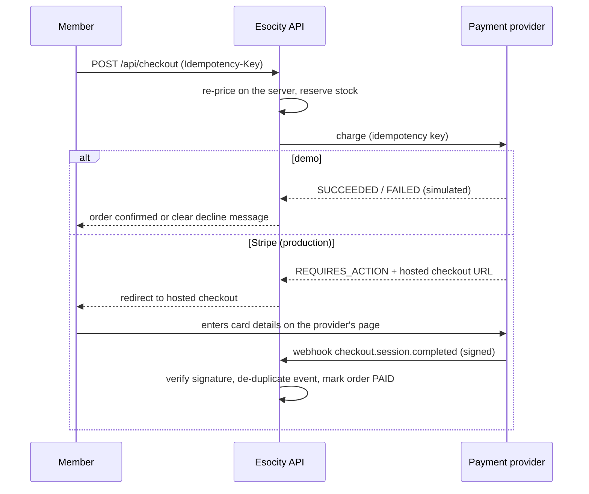

# Payments

**Esocity never collects, transmits or stores raw card details.** In demo mode no card data exists
at all; in production, card entry happens only on the payment provider's hosted checkout, and the
platform learns the outcome from signed webhooks.

Code: `src/server/providers/payments.ts` (port and adapters), `src/domain/checkout.ts` (pricing
and refund rules), `src/server/demo/commerce.ts` (demo flows). Tests:
`tests/unit/payments.test.ts`, `tests/unit/checkout-promotions.test.ts`.

## Provider port

```ts
interface PaymentProvider {
  readonly name: 'demo' | 'stripe'
  readonly simulated: boolean
  charge(input: ChargeInput): Promise<ChargeResult> // SUCCEEDED | FAILED | REQUIRES_ACTION (+ redirectUrl)
  refund(input: RefundInput): Promise<RefundResult>
}
```

| Adapter                 | When                                                                  | Behaviour                                                                                                                                                              |
| ----------------------- | --------------------------------------------------------------------- | ---------------------------------------------------------------------------------------------------------------------------------------------------------------------- |
| `DemoPaymentProvider`   | `DEMO_MODE=true` (default) or no Stripe key                           | Methods "Demo card", "Demo digital wallet" and "simulate a decline". Outcomes are immediate and labelled simulated; no money moves.                                    |
| `StripePaymentProvider` | `DEMO_MODE=false`, `PAYMENT_PROVIDER=stripe`, `STRIPE_SECRET_KEY` set | Creates a hosted **Checkout Session** with an idempotency key (`checkout:{reference}`) and returns its URL; refunds via the Refunds API (`refund:{payment}:{amount}`). |

## What is charged

| Purchase           | Amount                                          | Result on success                                                            |
| ------------------ | ----------------------------------------------- | ---------------------------------------------------------------------------- |
| Marketplace basket | Priced by `priceCheckout`                       | Order `PAID`, stock sold, reward points earned                               |
| Auction win        | Final auction price + delivery                  | Order moves from `PENDING_PAYMENT` to `PAID` within the payment window       |
| Buy Now (auction)  | Buy Now price, minus any bid-value price credit | Order `PAID`; eligible bids returned when the recovery mode is `RETURN_BIDS` |
| Flash Drop         | Drop price × quantity                           | Order `PAID` within the per-member limit                                     |
| Bid pack           | Pack price minus pack promotion                 | Credits granted after payment; no reward points                              |

`priceCheckout` works in integer minor units: subtotal, promotion discount (capped at the
subtotal), recovery credit, delivery (standard £3.99, free from £50 after discounts; express and
next-day options; bulky-item surcharge £15), and UK VAT at 20% **included** in prices
(`taxFromGross`). Tax-exclusive markets add tax on top. Totals are re-validated on the server —
the browser never sends prices.

## Flow



Failure handling: a declined payment leaves no order in a paid state, releases the stock
reservation and shows "Payment not completed" with the reason. Retrying uses the same idempotency
key, so a network retry can never charge twice.

## Webhooks (production)

`verifyStripeSignature(payload, header, secret)` checks the `t=…,v1=…` HMAC-SHA256 signature
against the **raw** request body with a constant-time comparison and rejects timestamps older than
five minutes (replay protection). Each provider event is stored once
(`payment_events_provider_event_key`), so redelivered webhooks are harmless. Wiring the
`/api/webhooks/stripe` route to the PostgreSQL order store is part of Phase 3
([ROADMAP.md](./ROADMAP.md)).

## Refunds

- Staff with `refunds.issue` (Finance, Admin, Super Admin) refund from `/admin/orders/[id]`.
- A reason is mandatory; the request carries an idempotency key (`admin-refund` scope).
- `refundableAmount` never allows more than was paid minus previous refunds; partial refunds
  leave the payment `PARTIALLY_REFUNDED`, a full refund makes it `REFUNDED` and moves the order to
  `REFUNDED`.
- Every refund is recorded (in PostgreSQL: `refunds` and `payment_events`) and written to the
  audit log.
- Cancelled auctions refund **bid credits** through the wallet ledger, not money.

## Payment windows

An auction winner has `winnerPaymentWindowHours` (72 by default) to pay. If the window passes, the
order is cancelled with the reason "Payment window expired", the reserved unit returns to stock
and the member is notified.

## PCI scope

Hosted checkout keeps card data entirely on the provider's domain, which keeps the platform in the
lightest PCI DSS scope (SAQ A). Do not add card fields, card tokenisation in the page, or any
logging of payment payloads beyond event ids and statuses. The logger redacts keys that look like
card, token or secret fields.
