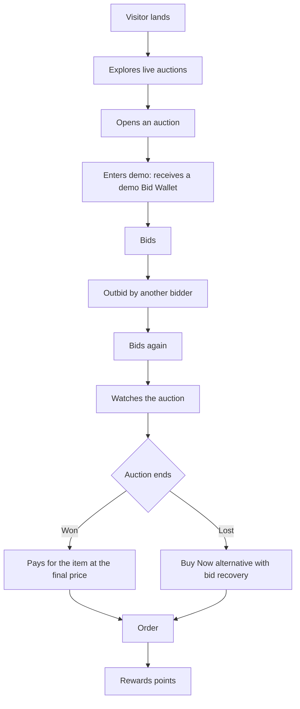
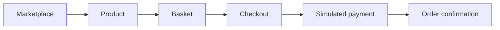

# Product — Esocity Bid

**The Intelligent Live Marketplace.** Live Commerce. Smarter Bidding.

Esocity Bid is a live-commerce platform. Live auctions are the headline experience, but they sit
inside a complete store: a fixed-price marketplace, Buy Now on every auction, Flash Drops, a
rewards programme, personalised discovery, responsible-use controls and an operations console
with fraud intelligence. That breadth is the Esocity difference:

```
LIVE AUCTIONS + MARKETPLACE + FLASH DROPS + BUY NOW + REWARDS
+ PERSONALISATION + RESPONSIBLE USE + ADVANCED OPERATIONS + FRAUD INTELLIGENCE
```

## Principles

1. **Transparent by design.** The cost of a bid, the price increment, the timer extension, the
   reserve, the minimum number of bidders and what happens to used bids are shown wherever a member
   can bid (`/how-it-works`, `/auction-rules`, and on every auction page).
2. **Fair and server-authoritative.** Bids, prices, clocks and winners are decided only on the
   server. Nobody — including staff — can choose or change a winner.
3. **Commerce first.** Every auctioned item can be bought outright. Losing bidders can recover
   eligible bids through Buy Now where the market and auction rules allow it.
4. **Responsible by default.** Members set daily and weekly bid limits, a monthly bid-pack budget
   and cool-off breaks; limits are enforced on the server and cannot be bypassed.
5. **No dark patterns.** Rewards are earned on product purchases and a few one-off achievements —
   never on buying or spending bids. Countdown urgency is real (server time), never fabricated.
6. **Honest demonstrations.** In demo mode, simulated bidders, payments, deliveries and analytics
   are labelled as simulated. Reference values and savings are demonstration data.

## Personas

| Persona                                                          | Needs                                                                                                                |
| ---------------------------------------------------------------- | -------------------------------------------------------------------------------------------------------------------- |
| **Deal seeker**                                                  | Discover live auctions, understand the rules quickly, bid confidently, fall back to Buy Now.                         |
| **Shopper**                                                      | Browse and buy at a fixed price with clear delivery, returns and VAT.                                                |
| **Collector / drop hunter**                                      | Be first to limited Flash Drops, with fair per-member limits.                                                        |
| **Loyal member**                                                 | Earn rewards, reach tiers, unlock perks.                                                                             |
| **Operator** (operations, merchandising, finance, support, risk) | Run auctions and stock, fulfil orders, handle refunds and tickets, review risk — with permissions matching the role. |

## Customer experience map

| Route                                                                                              | Purpose                                                                                   |
| -------------------------------------------------------------------------------------------------- | ----------------------------------------------------------------------------------------- |
| `/`                                                                                                | Landing: live now, ending soon, featured, drops, categories, how it works.                |
| `/discover`                                                                                        | Personalised feed: recommendations, ending soon, price drops, drops, recently won.        |
| `/marketplace`, `/category/[slug]`, `/search`                                                      | Catalogue with search, filters, sorting and pagination.                                   |
| `/product/[slug]`                                                                                  | Product detail: gallery, price, stock, delivery, related auction, add to basket, Buy Now. |
| `/auctions`, `/auction/[id]`                                                                       | Auction lists and the live auction page (bid, AutoBid, Buy Now, recovery, history).       |
| `/drops`                                                                                           | Flash Drops: upcoming, live, sold out.                                                    |
| `/buy-bids`, `/wallet`                                                                             | Bid packs and the Bid Wallet ledger.                                                      |
| `/checkout`, `/orders`, `/orders/[id]`                                                             | Basket, simulated payment, order tracking.                                                |
| `/rewards`, `/watchlist`, `/notifications`                                                         | Loyalty, saved items, updates.                                                            |
| `/account`, `/settings`, `/support`                                                                | Profile, addresses, responsible-use limits, preferences, help.                            |
| `/how-it-works`, `/auction-rules`, `/trust`, `/responsible-use`, `/terms`, `/privacy`, `/supplier` | Transparency, policy and partner pages.                                                   |
| `/demo`                                                                                            | Enter or leave the demo platform.                                                         |

## Core journeys (covered by end-to-end tests)





## Auction formats (configuration, not code)

Every auction carries its own rules, so formats are combinations of settings:

- **Classic** — bid increment, credit cost and a timer extension on each bid.
- **Hard stop** — the clock cannot be extended past a fixed end.
- **Reserve** — no sale (and bids refunded) if the reserve is not met.
- **Minimum bidders** — no sale (and bids refunded) if too few members take part.
- **Beginner / newcomer** — limited to members with few or no previous wins.
- **Tier-gated** — e.g. Gold members and above.
- **Per-member bid limit**, **participant cap**, **AutoBid on/off**, **Buy Now and recovery mode**.

## Operations console

`/admin` gives each role exactly what it needs: dashboard and analytics, auction management
(create, edit rules before bidding starts, pause with a reason, resume, cancel with refunds),
products and inventory, suppliers and purchase orders, orders and fulfilment, payments and
refunds, promotions, customers and wallets, support tickets, fraud intelligence, the AutoBid kill
switch and an immutable audit log. See [SECURITY.md](./SECURITY.md) for the role model.

## Out of scope for Phase 1

Real payments, real authentication, real-time push infrastructure, supplier integrations and
native apps are later phases — see [ROADMAP.md](./ROADMAP.md).
