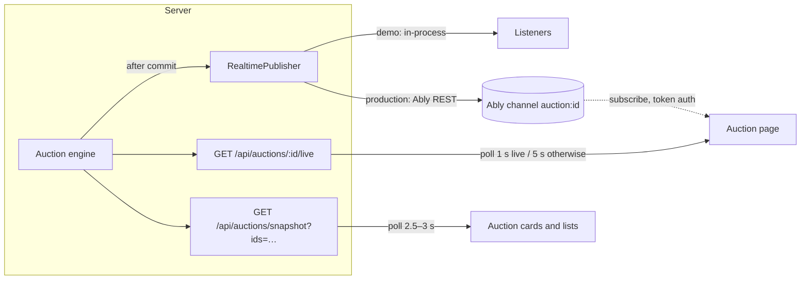

# Real-time

Live auctions need two things in the browser: an **accurate clock** and **fresh state**. Neither
is ever authoritative in the browser — they only display what the server decided.

## Server-synchronised clock

`src/lib/client/clock.ts` keeps one offset between the browser clock and server time:

- Every server-rendered page and API payload includes `serverTime`; the first sample seeds the
  offset, later samples refine it using the request round-trip time.
- A single `useSyncExternalStore` subscription ticks once per second for **all** countdowns on the
  page, so timers never re-render whole pages and never drift apart.
- Countdowns are computed from the authoritative `closeAt`, never from a local timer that counts
  down on its own. When the displayed time reaches zero the UI shows "Finalising…" until the
  server reports the outcome.
- Screen readers get polite announcements at 60, 30, 10 and 5 seconds (not every tick).

## Transport

| Mode                                  | How clients update                                                                                                                                                                                                                                                                                                               |
| ------------------------------------- | -------------------------------------------------------------------------------------------------------------------------------------------------------------------------------------------------------------------------------------------------------------------------------------------------------------------------------- |
| Demo (default)                        | The auction page polls a small authoritative snapshot every second while live (5 s otherwise, paused while the tab is hidden). Lists poll one batched snapshot endpoint for every visible card. Responses are `no-store` and tiny.                                                                                               |
| Production (`REALTIME_PROVIDER=ably`) | After each committed bid and at the close the engine publishes `bid` and `completed` events to `auction:{id}` via the implemented `AblyRealtimePublisher`. Phase 4 adds browser subscriptions with short-lived token auth and lifecycle events (pause, resume); polling stays on as a slow fallback and to heal missed messages. |

Every snapshot carries a `version`; clients discard anything older than what they already hold,
so out-of-order responses never move the price backwards.

## Why polling in demo mode

Vercel serverless functions do not hold WebSocket connections, and the demo must run with no
external services. Short polling against an in-memory snapshot is cheap, works everywhere and
exercises the same authoritative data path. Ably (or a similar managed service) is the production
upgrade because it fans out to thousands of viewers without holding connections on the app tier.

## Bidding UX under latency

- The bid button submits an intent and shows "Submitting…"; the price only changes when the server
  responds, never optimistically.
- Each click has an idempotency key; a network retry reuses it, so a flaky connection cannot
  double-bid.
- Outbid detection compares authoritative snapshots and shows "Outbid — bid again" with a toast.
- On phones a sticky bid bar keeps price, countdown and the bid action on screen while the member
  scrolls the rest of the page.

## Production checklist (Phase 4)

1. Publish from the engine only **after** the transaction commits.
2. Issue Ably tokens from an authenticated route with subscribe-only capability on
   `auction:{id}` channels.
3. Keep the CSP `connect-src` in `src/proxy.ts` aligned with the provider's hosts (already
   configured when `REALTIME_PROVIDER=ably`).
4. Monitor publish latency and the gap between commit and client receipt.
