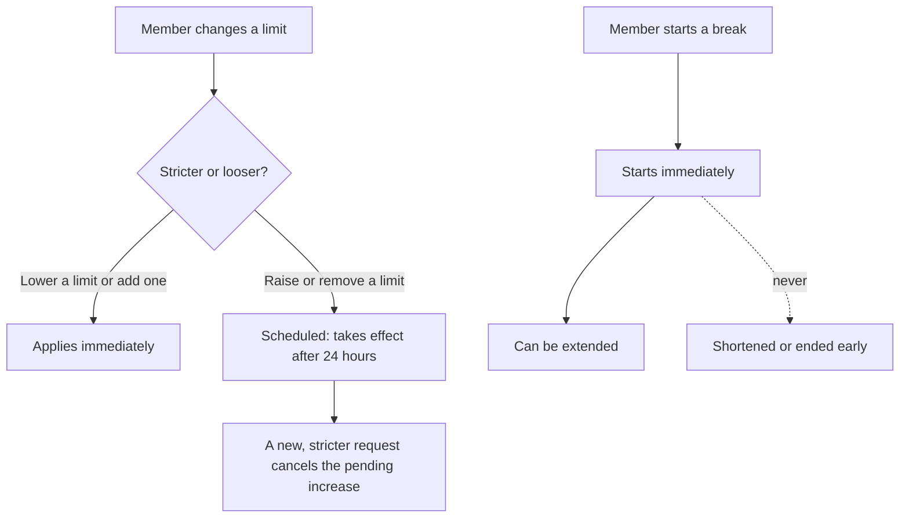

# Responsible use

Paid bidding can create financial risk. Esocity Bid gives members clear information and controls,
enforces those controls on the server for every bid (manual or AutoBid) and every bid-pack purchase,
and avoids design patterns that push people to spend more. There is deliberately no mechanism to
bypass a member's limits — not for members, not for staff.

Code: `src/domain/responsible-use.ts`. UI: `/account#responsible-use`, `/responsible-use`.
Tests: `tests/unit/responsible-use.test.ts`, `tests/unit/demo-backend.test.ts`,
`tests/e2e/journeys.spec.ts`.

## Member controls

| Control                              | Effect                                                      |
| ------------------------------------ | ----------------------------------------------------------- |
| **Daily bid limit**                  | Maximum bid credits spent per calendar day (UK time).       |
| **Weekly bid limit**                 | Maximum bid credits spent per week.                         |
| **Monthly bid budget**               | Maximum spent on bid packs per calendar month.              |
| **Take a break (cool-off)**          | 1, 7 or 30 days with bidding and bid-pack purchases paused. |
| **Spending and usage notifications** | Alerts at 50%, 80% and 100% of a limit.                     |

## Safety rules

- **Lowering or adding a limit applies immediately.**
- **Raising or removing a limit waits 24 hours** (the database enforces the delay:
  `limit_change_requests_delay`). The pending change is shown with its effective time, and a new
  stricter request replaces it.
- **A cool-off starts immediately and can be extended, never shortened.**
- Limits are checked on the server inside the bid transaction: an over-limit bid is rejected with
  `RESPONSIBLE_USE_LIMIT` and a plain explanation; an over-budget purchase is declined before
  payment.
- AutoBid respects the same limits and stops (with a notification) when one is reached.

## Product safeguards

- **Transparent costs.** Every auction shows the credit cost per bid, the price increment, the
  timer extension and the member's own bids in that auction. Bid packs show the price per bid.
- **Honest urgency.** Countdowns come from the server clock; there are no fake timers, fake
  scarcity or fabricated "others are viewing" pressure. Simulated demo activity is labelled.
- **No rewards for spending on bids.** Rewards points come from product purchases and a few one-off
  achievements (including setting your own limits), never from buying or spending bids.
- **Buy Now as a fallback.** Every auction item can be bought outright, and eligible bids can be
  recovered where the rules allow, so members are not pushed into chasing an auction.
- **Low-balance notices are informational**, not prompts to buy.
- **Signposting.** `/responsible-use` explains the controls and links to independent money and
  wellbeing support (e.g. MoneyHelper).

## Operations

- There is no operations tool to raise or remove a member's limits or end a break: only the member
  can change them, under the rules above.
- Risk indicators such as very high bid velocity are surfaced to analysts (see
  [FRAUD.md](./FRAUD.md)); outreach is supportive, never accusatory.
- Changes to limits are recorded (`USER_LIMITS` audit events).

## Future work

Reality-check reminders during long sessions, default limits for new members, monthly spend
summaries and cross-product self-exclusion are candidates for Phase 3, subject to the review in
[COMPLIANCE.md](./COMPLIANCE.md).
