# Roadmap

```mermaid
flowchart LR
  P1[1 MVP demo platform] --> P2[2 Production persistence]
  P2 --> P3[3 Auth + Stripe sandbox]
  P3 --> P4[4 Real-time infrastructure]
  P4 --> P5[5 Suppliers + fulfilment]
  P5 --> P6[6 AI personalisation]
  P6 --> P7[7 Mobile apps]
  P7 --> P8[8 Multi-market]
  P8 --> P9[9 White-label platform]
```

## Phase 1 — Esocity Bid MVP / demo platform ✅ (this repository)

A complete product demonstration deployable to Vercel with no external services.

- Customer experience: landing, discover, marketplace, categories, search, product pages, live
  auctions, Bid Wallet and packs, AutoBid, Buy Now with recovery, Flash Drops, checkout, orders,
  rewards, watchlist, notifications, account, responsible-use controls, support, transparency pages.
- Operations console with RBAC: dashboard, analytics, auctions, products, inventory, suppliers,
  orders, fulfilment, payments and refunds, promotions, customers, support, fraud, audit.
- Pure domain rules shared by the demo backend and a tested PostgreSQL auction engine; schema,
  migrations (with append-only triggers) and an idempotent seed.
- Security baseline, compliance hooks, CI (secret scan, format, lint, typecheck, unit, database and
  browser tests, build), documentation.

## Phase 2 — PostgreSQL + Redis production persistence

- Implement the production backend behind the existing API routes using the PostgreSQL engine and
  the schema in `db/`; move sessions, orders, drops, rewards, support and admin operations to the
  database.
- Upstash Redis for rate limits, locks and idempotency across instances (adapters already exist).
- Scheduled auction start and finalisation (Vercel Cron or a queue worker).
- Winner non-payment handling (second-chance offers), inventory projections in the database,
  unsold drop allocation returned to stock, throttle tier for risk decisions.
- Backups, migrations in CI/CD, observability (structured logs, traces, dashboards).
- Exit criteria: `DEMO_MODE=false` passes the full e2e suite against PostgreSQL + Redis.

## Phase 3 — Authentication + Stripe sandbox

- Auth.js or Clerk: sign-up, sign-in, email verification, MFA for staff, role management.
- Age confirmation flow and terms acceptance at sign-up (hooks exist).
- Stripe hosted Checkout for orders and bid packs in test mode; signed webhooks marking orders paid;
  refunds through the Stripe API.
- Transactional email (Resend): receipts, outbid, winning, shipping, limit notifications.
- Exit criteria: end-to-end purchases in Stripe test mode with webhooks, no card data on Esocity
  servers.

## Phase 4 — Production real-time auction infrastructure

- Ably (or equivalent) channels per auction with token auth; lifecycle events; polling as fallback.
- Load testing of bid bursts; lock contention and finalisation-lag monitoring.
- Fairness monitoring dashboards (bid timing, AutoBid share, outcome distributions).

## Phase 5 — Supplier and fulfilment integrations

- Supplier portal (feature flag `sellerPortal`): catalogue submissions, stock feeds, purchase-order
  confirmations.
- Warehouse and multi-carrier shipping integrations: labels, rates, tracking webhooks, returns
  portal.
- Real product photography through object storage.

## Phase 6 — AI recommendations and personalisation

- Recommendation service behind the existing `RecommendationProvider` port; personalised Discover,
  search ranking and notifications.
- Merchandising intelligence for operators: auction pricing and scheduling suggestions, demand
  forecasting, anomaly detection feeding fraud intelligence.
- Guardrails: no personalisation that works against responsible-use settings.

## Phase 7 — Mobile apps

- iOS and Android apps (React Native or native) on the same APIs; push notifications for outbid,
  ending soon and drops; biometric sign-in; the PWA remains available.

## Phase 8 — Multi-market / multi-currency

- Enable further markets after legal review (market configuration and flags already exist): IE
  (EUR), US (USD, state-by-state review), others.
- Localisation, tax engines, local payment methods, regional fulfilment.

## Phase 9 — Enterprise white-label auction platform

- Multi-tenant configuration: branding, catalogues, auction formats, compliance policies and
  reporting per tenant.
- Partner APIs and SDKs; tenant-level analytics; SLA-backed hosting.
